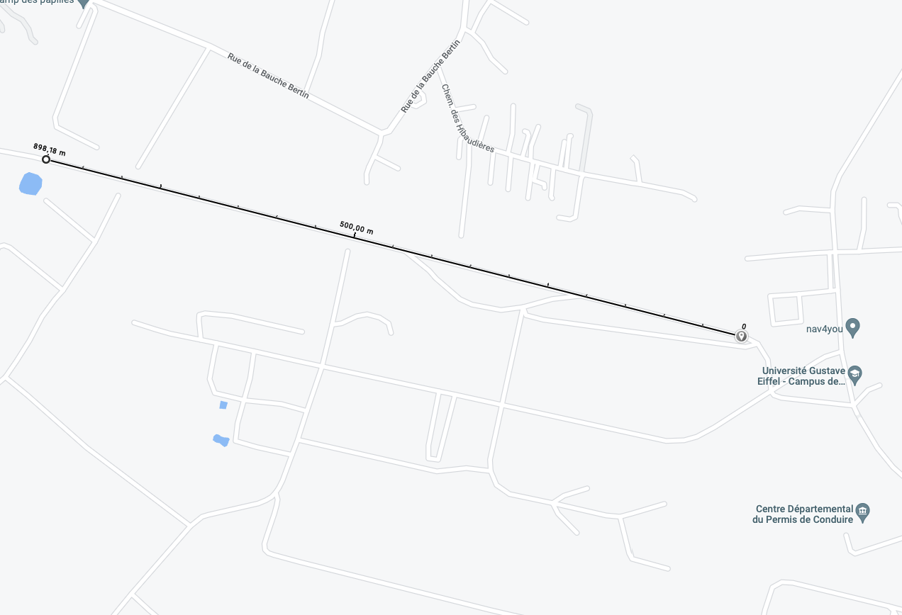

# Données 

## Un identifiant de trace

On créé un dossier **/R** à la racine de **WorkinprogReze**, dans lequel on stockera les scripts R. On y place dedans le fichier **Statistiques.R** qui va créer de nombreux tableaux de données à partir des données brutes.


On charge les données issues de **metabase** et on compile en entrée le script **Statistiques.R** :
```{r}
load(here("noisecapture_data.Rda"))
source(here("R","Statistiques.R"))
```

On va créer, à partir de l'identifiant **Id** des utilisateurs, les variables suivantes :

  * **IdTraceReset** : c'est un identifiant de trace par utilisateur, qui s'incrémente dès que le temps passé entre deux enregistrements excède 1 s ;
  * **IdGlobal** qui concatène **Id** et **IdTraceReset**, de manière à avoir un identifiant unique par trace (via **stringr::str\_c**);
  * **IdTrace**, reformulation de l'identifiant de trace sous forme d'identifiant numérique unique (via **dplyr::cur\_group\_id**).
  
  
```{r}
noisecapture_data <- as.data.frame(noisecapture_data)
trace_table <- as.data.frame(noisecapture_data[,c("Id","Date","x","y","leq_mean","tags")]) %>%
  arrange(Id,Date) %>%
  group_by(Id) %>%
  arrange(Date) %>%
  mutate(IdTraceReset=cumsum(c(TRUE, as.integer(diff(as.POSIXct(Date)), units = "secs") >= 2L))) %>%
  ungroup() %>%
  mutate(IdGlobal=str_c(Id,IdTraceReset)) %>%
  arrange(IdGlobal) %>%
  group_by(Id) %>%
  arrange(IdTraceReset) %>%
  group_by(IdGlobal) %>%
  mutate(IdTrace=cur_group_id()) %>%
  ungroup() %>%
  distinct(IdTrace, .keep_all = TRUE)
```

On supprime ensuite les traces :

  * sans tag ;
  * dont les coordonnées gps sont manquantes ;
  
```{r}
tags_table <- trace_table %>%
  filter(tags != "") %>%
  filter(x != "NA") %>%
  select(-c(IdGlobal,IdTraceReset))
```

## Question en suspens

Comment déterminer qu'une trace fait plus de 500 m ? En calculant les distances entre les points pris deux à deux, puis en sommant ces distances. Le package **{sf}** fournit la fonction **st_distance** pour le calcul d'une matrice de distances, et **st_length** pour le calcul de la distance rectiligne entre deux points.

Soient deux points de la piste de glissance, séparés (d'après Google Maps, cf. figure ci-après) par une distance de 898,18 m. Je ne comprends pas pourquoi le résultat retourné par les fonctions de **{sf}** diffèrent du calcul de Google Maps.

```{r cars}
coo <- matrix(c(
  47.155448754072374, -1.6406400682309141,
47.15744374926704, -1.652151433982812
), ncol=2,  byrow=T)  
coo_col <- data.frame(coo)
dimnames(coo_col)[[2]] <- c("latitude","longitude")

coord_col <- SpatialPointsDataFrame(coords=coo_col[,1:2], data=as.data.frame(coo_col))
coord_col_sf <- st_as_sf(coord_col, crs = 4326, agr = "constant", remove = F)
st_crs(coord_col_sf) <- 4326 #EPSG WGS84

# Calcul de la distance entre les deux points
my_coords_sf <- st_as_sf(coo_col, coords = c("latitude","longitude"), crs = 4326)
st_distance(coord_col_sf)

# Même résultat avec la fonction ci-dessous (attention : elle
# n'aime pas les noms de colonnes, c'est pourquoi le jeu de données est coo
# et pas coo_col)
line = st_sfc(st_linestring(coo), crs = 4326)
st_length(line)
```


